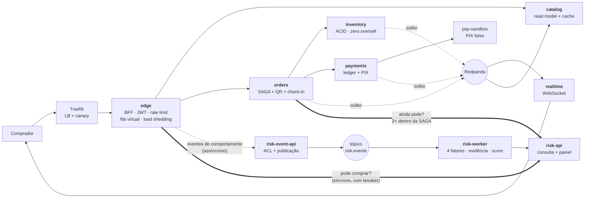

# Risk-Shield — Antifraude Mínimo Viável para Bilheteria

> **Projeto Final — Engenharia de Sistemas Distribuídos 2026.1**
> **POC 2 (Seção 4.2): antifraude mínimo viável.**
> Domínio hospedeiro: uma plataforma de venda de ingressos sob pico, construída
> para que o antifraude tivesse onde funcionar de verdade.

Um motor de *risk scoring* multifatorial que detecta cambistas, bots e conluio
em tempo real, e coloca compradores suspeitos em quarentena — **integrado ao
checkout de um sistema de vendas real**, e não a um simulador.

**9 microsserviços em 18 contêineres**, inteiramente em Docker Compose.
Um comando sobe tudo.

```bash
make up         # sobe os dois sistemas e carrega 40.000 assentos de demonstração
make scenarios  # os 6 cenários de fraude, com 2 falsos positivos que devem passar
make risk-gate  # o portão no checkout, com o antifraude derrubado no meio
make demo       # roteiro guiado da apresentação
```

Painel do antifraude: **http://localhost:3022/**

---

## O problema

Detectar fraude é fácil se você puder errar. O difícil é a segunda metade:

> **Pegar o cambista sem bloquear a família que comprou seis lugares do mesmo
> notebook.**

Um antifraude que quarentena todo mundo acerta 100% dos fraudadores e é inútil —
o custo do falso positivo aqui é negar a venda a um cliente legítimo, e esse
custo é imediato e visível. Por isso **dois dos seis cenários de teste são
compradores honestos com sinais suspeitos reais, e a asserção é que passem.**

Isso obriga a resolver quatro problemas de sistemas distribuídos:

| Pressão | Por que é difícil |
|---|---|
| O sinal é coletivo | Conluio é invisível para qualquer regra que olhe uma conta por vez |
| A decisão está no caminho crítico | Uma consulta síncrona dentro do checkout, que não pode derrubá-lo |
| O detector também falha | Se o antifraude cai, a venda para? Não há resposta técnica — é decisão de produto |
| A compra dura segundos | A decisão pode mudar **no meio** da transação, depois de o dinheiro ter sido capturado |

### E o domínio hospedeiro

O antifraude precisa de vendas reais para observar. A bilheteria existe para
isso — e é um problema distribuído por mérito próprio: 40.000 ingressos em 90
segundos, **overselling = zero**, PIX externo cujo timeout não diz se a cobrança
falhou, e falha parcial como norma.

Essa escolha é o que torna a POC 2 demonstrável de verdade: é porque existe uma
SAGA real que dá para mostrar uma quarentena chegando **depois do pagamento** e
forçando estorno — o cenário mais caro e mais informativo do projeto.

---

## Dois princípios organizadores

**1. Consistência forte é cara, então ela é gasta só onde a violação é inaceitável.**

Há exatamente dois lugares assim: o assento e o dinheiro. Esses pontos são ACID e
deliberadamente pequenos. Todo o resto é eventualmente consistente, alimentado
por eventos. E como o núcleo ACID não escala junto com o resto, ele não é
reforçado — é **protegido** por controle de admissão.

**2. Um serviço só existe se tiver uma fronteira de consistência própria ou um
perfil de escala próprio.** Todo o resto é módulo. O desenho original tinha dez
serviços; a regra cortou para seis sem perder nenhum padrão
([ADR-0001](docs/adr/0001-microsservicos.md)). A mesma regra produziu os três do
antifraude — e nenhum a mais.



As setas grossas são o acoplamento síncrono, e são só duas. Tudo o que alimenta o
antifraude é assíncrono: **a venda nunca espera pela detecção**, só pela decisão.

Detalhamento completo, com os três níveis de C4, em
[`docs/arquitetura.md`](docs/arquitetura.md).

---

## Como executar

Requisito único: **Docker**. Nada mais precisa estar instalado — as ferramentas
rodam dentro da rede do Compose.

```bash
git clone https://github.com/NicholasRodrigues/dist-sys.git
cd dist-sys
make up
```

Em cerca de um minuto:

| Endereço | O quê |
|---|---|
| http://localhost:8080/ | Interface: mapa de assentos ao vivo, fila, compra, portaria |
| http://localhost:3022/ | **Painel do antifraude** — scores, evidências em texto, pesos e limiar |
| http://localhost:16686 | Jaeger — o trace de uma compra, 43 spans atravessando os 10 serviços |
| http://localhost:3030/d/bilheteria | Grafana — latências, fila, circuit breakers |
| http://localhost:9090 | Prometheus — 12 alvos, em dois jobs |
| http://localhost:8081 | Traefik — roteamento e pesos |

### Todos os comandos

`make help` lista tudo. Os principais:

| Comando | O que faz |
|---|---|
| `make up` / `make down` / `make clean` | Sobe, derruba, apaga volumes |
| `make test` | A bateria completa: unitários, fumaça, caos, antifraude e invariantes |
| `make smoke` | 30 verificações ponta a ponta |
| `make chaos` | 6 cenários com falha injetada |
| `make scenarios` | Os 6 cenários do antifraude, com 2 falsos positivos |
| `make risk-gate` | O portão antifraude no checkout, com o `risk-api` parado no meio |
| `make risk-config` | Pesos, limiar e estatísticas do antifraude |
| `make risk-reset` | Zera eventos e scores do antifraude, preservando configuração |
| `make invariants` | As 6 consultas que não podem retornar linha |
| `make load` | Teste de carga (`K6_VUS`, `K6_DURATION`) |
| `make load-without-queue` / `make load-with-queue` / `make compare` | O gráfico da apresentação |
| `make contention` | Contenção máxima: todos no mesmo setor |
| `make canary PCT=10` / `make blue-green TO=green` / `make rollback` | Estratégias de deployment |
| `make flags ARGS="admission_rate=100"` | Feature flags em tempo de execução |
| `make demo` | Roteiro guiado da demonstração |
| `make logs` / `make ps` | Operação |

---

## O que está provado, com número

Tudo abaixo é reproduzível pelos comandos acima. Detalhe completo em
[`docs/resultados/`](docs/resultados/README.md).

### Antifraude — ele discrimina (`make scenarios`, 6/6)

| Cenário | Score | Resultado |
|---|---|---|
| Comprador legítimo | 0,0 | livre |
| **Família: 4 contas, 1 notebook, 1 Wi-Fi, 1 cartão** | **22,5** | **livre** |
| **1 conta em 15 dispositivos, ritmo humano** | **43,6** | **livre** |
| Bot solitário: 14 tentativas a cada 300 ms, sem ler o mapa | 75,0 | quarentena |
| Conluio: 12 contas, 12 devices, 12 IPs, mesmo setor em segundos | 91,9 | quarentena |
| Fazenda: 20 contas, 1 dispositivo, 1 IP | 100,0 | quarentena |

Os dois em negrito são o teste que importa. O limiar de 70 cai entre 43,6 e 75,0
— folga de mais de 30 pontos para os dois lados.

Os pesos codificam uma regra de decisão, não um chute: **nenhum fator sozinho
quarentena (maior peso 38); dois fatores quaisquer no máximo, sim (menor par
35+35 = 70)** — verificado por teste unitário. A versão anterior somava 100 e era
cega ao bot solitário *por construção*
([ADR-0013](docs/adr/0013-pesos-e-limiar-do-score.md)).

E cada decisão vem com o motivo em português: *"12 contas distintas compraram no
setor MEZANINO em 30 segundos: aquisição coordenada"*. Ninguém libera um
comprador olhando para um número.

### Antifraude — ele muda a venda (`make risk-gate`, 15/15 em 3 fases)

- Comprador em quarentena → **HTTP 403 com o motivo**, sem consumir assento nem criar pedido
- Quarentena que chega **depois do pagamento** → a SAGA compensa com **estorno** + devolve o assento
- Com o `risk-api` **realmente parado**: `fail_open` vende, `fail_closed` bloqueia,
  e a chave vira em tempo de execução sem reiniciar nada ([ADR-0015](docs/adr/0015-fail-open-no-portao-antifraude.md))
- Circuit breaker mantém o checkout em **268 ms** com a dependência morta

### Antifraude — quanto custou (`make compare-risk`)

A verificação é síncrona no caminho mais crítico. Mesma carga, uma flag trocada:

| | sem antifraude | com antifraude |
|---|---|---|
| compras confirmadas | 2.121 | 2.177 |
| p95 do checkout | 3.411 ms | 3.076 ms |
| erro no checkout | 0,84% | **2,54%** |

**O custo em latência fica abaixo da variação entre repetições** — a consulta é
um `SELECT` por chave primária numa projeção de leitura, atrás de um breaker. O
custo real é a taxa de erro: +1,7 ponto de checkouts recusados, que são os
compradores quarentenados. Esse é o preço de a verificação valer alguma coisa.

---

### O domínio hospedeiro, resumido

**Correção**

- 40 compradores no **mesmo** assento → exatamente **1** confirmado
- 50 requisições concorrentes com a **mesma** chave → **1** pedido, **1** cobrança
- Ledger de dupla entrada: soma de todos os lançamentos = **0**, sempre

**Resiliência** (6/6) — PSP fora do ar → breaker abre e nenhum assento fica preso;
PSP cobra e engole a resposta → reconciliado, 1 cobrança; 50% de erro → todos os
pedidos chegam a estado terminal.

**Fila virtual** — medida em **dois pontos de operação**, e é a comparação que
mais ensina:

| | 200 VUs | | 600 VUs | |
|---|---|---|---|---|
| | sem fila | com fila | sem fila | com fila |
| compras confirmadas | 2.488 | 2.198 | 1.669 | **2.724** |
| p99 do checkout | 5,02 s | 6,36 s | 10,96 s | **2,10 s** |

A 200 VUs a fila **atrapalha**: o núcleo não está saturado, e o controle de
admissão só acrescenta espera. A 600 VUs ela vende **63% mais** com p99 **5×
menor**. A fila não aumenta a capacidade — ela **escolhe o ponto de operação**, e
só compensa depois do joelho da curva. Custo declarado: 13,2 s de espera no p95.

---

## Documentação

| Documento | Conteúdo |
|---|---|
| [`docs/proposta.md`](docs/proposta.md) | Proposta de tema próprio (formato de 1 página, Seção 3) |
| [`docs/arquitetura.md`](docs/arquitetura.md) | C4 níveis 1, 2 e 3, catálogo de serviços, stack |
| [`docs/padroes.md`](docs/padroes.md) | Cada tópico da Seção 6 → onde vive → como provar |
| [`docs/escopo.md`](docs/escopo.md) | O que entra, o que fica de fora, e por quê |
| [`docs/plano-de-testes.md`](docs/plano-de-testes.md) | Invariantes, carga, resiliência, antifraude, integração |
| [`docs/poc2/plano.md`](docs/poc2/plano.md) | **POC 2 — antifraude:** mapeamento de domínio, C4, cenários e o que mudou do rascunho |
| [`docs/resultados/`](docs/resultados/README.md) | **Resultados medidos** |
| [`docs/trade-offs.md`](docs/trade-offs.md) | 11 decisões com custo e condição de reversão |
| [`docs/apresentacao.md`](docs/apresentacao.md) | **Guia passo a passo da apresentação** — o que rodar, o que dizer, e o que fazer se travar |
| [`docs/roadmap.md`](docs/roadmap.md) | Fases, trilhas e roteiro cronometrado do videocast |
| [`docs/adr/`](docs/adr/) | Architecture Decision Records |

---

## Estrutura do código

```
src/
  shared/          Tracing OTLP, circuit breaker, outbox, idempotência, JWT
    riskEvents.ts  Camada de anticorrupção: dois formatos externos, um interno
    riskClient.ts  A fronteira entre os dois sistemas, e a política de falha
  services/
    edge/          Gateway, fila virtual, rate limit, load shedding, portão de risco
    catalog/       Read model CQRS com cache-aside
    inventory/     Dono do assento — ACID, hold com TTL, reaper
    orders/        SAGA, emissão do QR, check-in, verificação de risco em 2 pontos
    payments/      Ledger de dupla entrada, ACL do PSP
    realtime/      Fan-out por WebSocket
    psp/           PIX falso com injeção de falha
    risk-event-api/  Recebe, normaliza e publica eventos de comportamento
    risk-worker/     Motor de scoring multifatorial — o lado de comando do CQRS
    risk-api/        Consulta de risco e painel administrativo — o lado de consulta
  migrations/      Um banco lógico por serviço
  tools/           seed, smoke, chaos, invariants, simulator, risk-gate, risk, deploy, demo
tests/unit/        59 testes
web/admin.html     Painel do antifraude
load/              Cenários k6
infra/             Traefik, Prometheus, Grafana
```

---

## Videocast

> Link a incluir antes da entrega final (obrigatório pelo checklist da Seção 7).

Para apresentar: **[`docs/apresentacao.md`](docs/apresentacao.md)** tem o passo a
passo completo — preparação, os dez blocos com o que rodar e o que dizer em cada
um, as perguntas prováveis com as respostas, e o plano B se a demo travar ao vivo.
O roteiro cronometrado por integrante está em [`docs/roadmap.md`](docs/roadmap.md).

---

## Equipe

| Integrante | Trilha | Contato |
|---|---|---|
| Nicholas Rodrigues | Risk API, painel e integração com a Bilheteria | nicholasgabriel65@gmail.com |
| Arthur Miranda Tavares | _a confirmar_ | _a preencher_ |
| Pedro Henrique de Araújo Lima | _a confirmar_ | _a preencher_ |
| Tiago Trindade de Oliveira | _a confirmar_ | _a preencher_ |

> A Seção 2.1 da especificação prevê equipes de 5 integrantes; este grupo tem 4.
> O checklist da Seção 7 também exige **histórico de commits mostrando
> contribuição de todos os membros**, e a Seção 5 diz que cada integrante recebe
> avaliação individual baseada nos commits — hoje o histórico tem um único autor.

---

## Ferramentas de IA utilizadas

> Seção obrigatória (Seção 5). **A omissão desclassifica a entrega**,
> independentemente da qualidade técnica do restante.

### Ferramentas

| Ferramenta | Onde atuou |
|---|---|
| Claude Code (Anthropic) | Planejamento da arquitetura, redação dos ADRs e da documentação, implementação dos serviços, escrita dos testes e execução da bateria de verificação |
| _a preencher_ | |

### Como a IA foi orientada

O ponto de partida foi o PDF de especificação da disciplina, fornecido
integralmente como contexto, junto da instrução de propor um tema próprio de
venda de ingressos que atendesse aos requisitos mínimos da Seção 3.

A condução foi por restrição, e não por pedido aberto. Três intervenções
mudaram materialmente o resultado:

1. **"Dez serviços não é demais?"** — levou à regra de extração do ADR-0001 e ao
   corte para seis, sem perda de padrões.
2. **"Fique só no que a especificação exige."** — levou à releitura do documento
   separando exigência de bônus, à descoberta de que Kubernetes nunca foi pedido,
   e ao `docs/escopo.md`.
3. **"Teste você mesmo até ter certeza de que funciona."** — levou à bateria de
   verificação executável, que encontrou bugs reais.

Cada serviço foi especificado em prosa — invariantes, contratos de API, eventos
publicados e consumidos — antes de qualquer geração de código.

### Avaliação honesta

**O que funcionou.** A geração de código repetitivo mas cuidadoso: migrações com
constraints corretas, o cliente HTTP com breaker e retry, a estrutura da SAGA.
A documentação de decisões arquiteturais também saiu forte quando o contexto era
específico.

**O que precisou ser corrigido.** Os bugs reais só apareceram quando os testes
foram executados de verdade — o que reforça que revisar código gerado lendo não
substitui rodar:

- **Circuit breaker que nunca abria.** Um `4xx` chamava `onSuccess()` e zerava o
  contador de falhas. Com o PSP fora do ar, o `404` da consulta zerava o contador
  antes de o `503` da cobrança abrir o breaker. Corrigido, com teste de regressão.
- **JWT com janela de expiração.** A comparação usava `exp < agora` em vez de
  `exp <= agora`, aceitando por até um segundo um token já vencido.
- **Testes que testavam a si mesmos.** Um `reset` do PSP enviava `content-type:
  application/json` sem corpo, o Fastify recusava com 400, e a falha silenciosa
  contaminou três cenários seguidos.
- **Medições que mediam o harness.** A primeira comparação de carga estava
  dominada pelo rate limit por IP — o gerador inteiro sai de um endereço só — e
  pelo PSP falso respondendo instantaneamente, o que nunca saturava o núcleo.

**O que foi descartado.** O plano inicial tinha Kubernetes, mTLS, OPA, Cosign,
criptografia pós-quântica, Keycloak, Debezium, Unleash e Toxiproxy. A releitura
da especificação mostrou que nada disso era exigido — o checklist pede "Docker
Compose ou equivalente". O escopo da bilheteria caiu de ~20 para 15 contêineres;
o antifraude da POC 2 acrescentou 3, chegando a 18.

---

## Licença e integridade acadêmica

Código autoral produzido pela equipe. Dependências de terceiros declaradas em
`package.json`.
