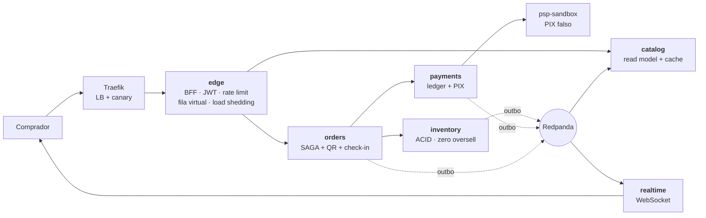

# Bilheteria — Plataforma Distribuída de Venda de Ingressos

> **Projeto Final — Engenharia de Sistemas Distribuídos 2026.1**
> Tema próprio (Seção 3): venda de ingressos sob pico de demanda (*flash sale*).

Sistema completo e funcional: **6 microsserviços em 14 contêineres**, executando
inteiramente em Docker Compose. Um comando sobe tudo.

```bash
make up      # sobe o sistema e carrega 40.000 assentos de demonstração
make test    # unitários + ponta a ponta + resiliência
make demo    # roteiro guiado da apresentação
```

---

## O problema

Vender ingresso é fácil. Vender 40.000 ingressos em 90 segundos, sem vender o
mesmo assento duas vezes, sem derrubar o site e sem perder o dinheiro de ninguém
é um problema de sistemas distribuídos inteiro condensado em um único caso de uso.

| Pressão | Por que é difícil |
|---|---|
| Pico de 100× a 1000× sobre a média | Capacidade que precisa existir só nesse minuto |
| Contenção extrema | Todo mundo quer o mesmo setor, os mesmos assentos |
| Invariante inegociável | **Overselling = zero.** Não existe "eventualmente consistente" para assento |
| Rede externa no meio | Um timeout do PIX **não** diz se a cobrança falhou |
| Falha parcial é a norma | Um serviço lento não pode virar cascata |

---

## Dois princípios organizadores

**1. Consistência forte é cara, então ela é gasta só onde a violação é inaceitável.**

Há exatamente dois lugares assim: o assento e o dinheiro. Esses pontos são ACID e
deliberadamente pequenos. Todo o resto é eventualmente consistente, alimentado
por eventos. E como o núcleo ACID não escala junto com o resto, ele não é
reforçado — é **protegido** por controle de admissão.

**2. Um serviço só existe se tiver uma fronteira de consistência própria ou um
perfil de escala próprio.** Todo o resto é módulo. O desenho original tinha dez
serviços; a regra cortou para seis sem perder nenhum padrão
([ADR-0001](docs/adr/0001-microsservicos.md)).



Detalhamento completo, com os três níveis de C4, em
[`docs/arquitetura.md`](docs/arquitetura.md).

---

## Como executar

Requisito único: **Docker**. Nada mais precisa estar instalado — as ferramentas
rodam dentro da rede do Compose.

```bash
git clone https://github.com/NicholasRodrigues/dist-sys.git
cd dist-sys
make up
```

Em cerca de um minuto:

| Endereço | O quê |
|---|---|
| http://localhost:8080/ | Interface: mapa de assentos ao vivo, fila, compra, portaria |
| http://localhost:16686 | Jaeger — o trace da SAGA, 25 spans atravessando 5 serviços |
| http://localhost:3030/d/bilheteria | Grafana — latências, fila, circuit breakers |
| http://localhost:9090 | Prometheus |
| http://localhost:8081 | Traefik — roteamento e pesos |

### Todos os comandos

`make help` lista tudo. Os principais:

| Comando | O que faz |
|---|---|
| `make up` / `make down` / `make clean` | Sobe, derruba, apaga volumes |
| `make test` | Unitários + ponta a ponta + resiliência |
| `make smoke` | 28 verificações ponta a ponta |
| `make chaos` | 6 cenários com falha injetada |
| `make invariants` | As 6 consultas que não podem retornar linha |
| `make load` | Teste de carga (`K6_VUS`, `K6_DURATION`) |
| `make load-without-queue` / `make load-with-queue` / `make compare` | O gráfico da apresentação |
| `make contention` | Contenção máxima: todos no mesmo setor |
| `make canary PCT=10` / `make blue-green TO=green` / `make rollback` | Estratégias de deployment |
| `make flags ARGS="admission_rate=100"` | Feature flags em tempo de execução |
| `make demo` | Roteiro guiado da demonstração |
| `make logs` / `make ps` | Operação |

---

## O que está provado, com número

Tudo abaixo é reproduzível pelos comandos acima. Detalhe completo em
[`docs/resultados/`](docs/resultados/README.md).

**Correção**

- 40 compradores no **mesmo** assento → exatamente **1** confirmado, 1 ingresso válido
- 50 requisições concorrentes com a **mesma** chave → **1** pedido, **1** cobrança
- 120 usuários disputando um setor → **0** erros de servidor, invariantes intactas
- Ledger de dupla entrada: soma de todos os lançamentos = **0**, sempre

**Resiliência** (6/6 cenários)

- PSP fora do ar → circuit breaker abre, e **nenhum assento fica preso**
- PSP cobra e engole a resposta → reconciliado, **1 cobrança**, sem estorno indevido
- 50% de erro no PSP → **todos** os pedidos chegam a estado terminal

**Fila virtual** (250 VUs, 45 s)

| | Sem fila | Com fila |
|---|---|---|
| p99 do checkout | 5,01 s | **2,70 s** |
| Erro no checkout | 1,46% | **0,36%** |
| Pior caso | 8,62 s | **2,76 s** |

A fila não aumenta a capacidade — ela **escolhe o ponto de operação**. Sem ela, a
espera não desaparece: fica escondida dentro de um checkout lento, onde o usuário
não entende o que está acontecendo.

---

## Documentação

| Documento | Conteúdo |
|---|---|
| [`docs/proposta.md`](docs/proposta.md) | Proposta de tema próprio (formato de 1 página, Seção 3) |
| [`docs/arquitetura.md`](docs/arquitetura.md) | C4 níveis 1, 2 e 3, catálogo de serviços, stack |
| [`docs/padroes.md`](docs/padroes.md) | Cada tópico da Seção 6 → onde vive → como provar |
| [`docs/escopo.md`](docs/escopo.md) | O que entra, o que fica de fora, e por quê |
| [`docs/plano-de-testes.md`](docs/plano-de-testes.md) | Invariantes, carga, resiliência, integração |
| [`docs/resultados/`](docs/resultados/README.md) | **Resultados medidos** |
| [`docs/trade-offs.md`](docs/trade-offs.md) | 11 decisões com custo e condição de reversão |
| [`docs/roadmap.md`](docs/roadmap.md) | Fases, trilhas e roteiro do videocast |
| [`docs/adr/`](docs/adr/) | Architecture Decision Records |

---

## Estrutura do código

```
src/
  shared/          Tracing OTLP, circuit breaker, outbox, idempotência, JWT
  services/
    edge/          Gateway, fila virtual, rate limit, load shedding
    catalog/       Read model CQRS com cache-aside
    inventory/     Dono do assento — ACID, hold com TTL, reaper
    orders/        SAGA, emissão do QR, check-in
    payments/      Ledger de dupla entrada, ACL do PSP
    realtime/      Fan-out por WebSocket
    psp/           PIX falso com injeção de falha
  migrations/      Um banco lógico por serviço
  tools/           seed, smoke, chaos, invariants, compare, deploy, demo
tests/unit/        28 testes
load/              Cenários k6
infra/             Traefik, Prometheus, Grafana
```

---

## Videocast

> Link a incluir antes da entrega final (obrigatório pelo checklist da Seção 7).
> Roteiro cronometrado em [`docs/roadmap.md`](docs/roadmap.md);
> `make demo` executa a sequência da demonstração.

---

## Equipe

| Integrante | Trilha | Contato |
|---|---|---|
| _a preencher_ | Plataforma e Deployment | |
| _a preencher_ | Borda e Admissão | |
| _a preencher_ | Núcleo de Vendas | |
| _a preencher_ | Transações e Ingresso | |
| _a preencher_ | Dinheiro e Presença | |

---

## Ferramentas de IA utilizadas

> Seção obrigatória (Seção 5). **A omissão desclassifica a entrega**,
> independentemente da qualidade técnica do restante.

### Ferramentas

| Ferramenta | Onde atuou |
|---|---|
| Claude Code (Anthropic) | Planejamento da arquitetura, redação dos ADRs e da documentação, implementação dos serviços, escrita dos testes e execução da bateria de verificação |
| _a preencher_ | |

### Como a IA foi orientada

O ponto de partida foi o PDF de especificação da disciplina, fornecido
integralmente como contexto, junto da instrução de propor um tema próprio de
venda de ingressos que atendesse aos requisitos mínimos da Seção 3.

A condução foi por restrição, e não por pedido aberto. Três intervenções
mudaram materialmente o resultado:

1. **"Dez serviços não é demais?"** — levou à regra de extração do ADR-0001 e ao
   corte para seis, sem perda de padrões.
2. **"Fique só no que a especificação exige."** — levou à releitura do documento
   separando exigência de bônus, à descoberta de que Kubernetes nunca foi pedido,
   e ao `docs/escopo.md`.
3. **"Teste você mesmo até ter certeza de que funciona."** — levou à bateria de
   verificação executável, que encontrou bugs reais.

Cada serviço foi especificado em prosa — invariantes, contratos de API, eventos
publicados e consumidos — antes de qualquer geração de código.

### Avaliação honesta

**O que funcionou.** A geração de código repetitivo mas cuidadoso: migrações com
constraints corretas, o cliente HTTP com breaker e retry, a estrutura da SAGA.
A documentação de decisões arquiteturais também saiu forte quando o contexto era
específico.

**O que precisou ser corrigido.** Os bugs reais só apareceram quando os testes
foram executados de verdade — o que reforça que revisar código gerado lendo não
substitui rodar:

- **Circuit breaker que nunca abria.** Um `4xx` chamava `onSuccess()` e zerava o
  contador de falhas. Com o PSP fora do ar, o `404` da consulta zerava o contador
  antes de o `503` da cobrança abrir o breaker. Corrigido, com teste de regressão.
- **JWT com janela de expiração.** A comparação usava `exp < agora` em vez de
  `exp <= agora`, aceitando por até um segundo um token já vencido.
- **Testes que testavam a si mesmos.** Um `reset` do PSP enviava `content-type:
  application/json` sem corpo, o Fastify recusava com 400, e a falha silenciosa
  contaminou três cenários seguidos.
- **Medições que mediam o harness.** A primeira comparação de carga estava
  dominada pelo rate limit por IP — o gerador inteiro sai de um endereço só — e
  pelo PSP falso respondendo instantaneamente, o que nunca saturava o núcleo.

**O que foi descartado.** O plano inicial tinha Kubernetes, mTLS, OPA, Cosign,
criptografia pós-quântica, Keycloak, Debezium, Unleash e Toxiproxy. A releitura
da especificação mostrou que nada disso era exigido — o checklist pede "Docker
Compose ou equivalente". O escopo caiu de ~20 para 14 contêineres.

---

## Licença e integridade acadêmica

Código autoral produzido pela equipe. Dependências de terceiros declaradas em
`package.json`.
