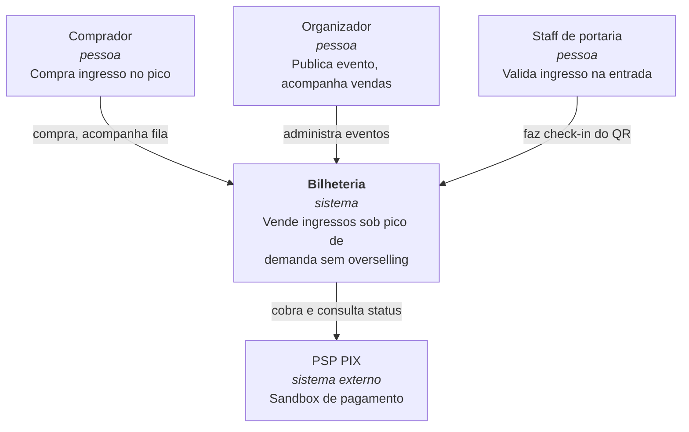
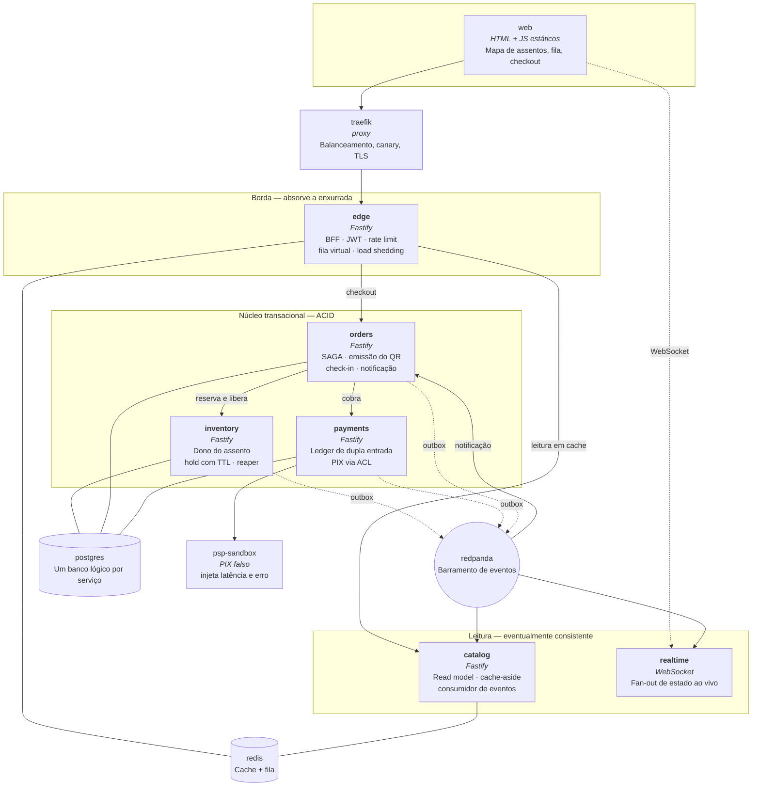
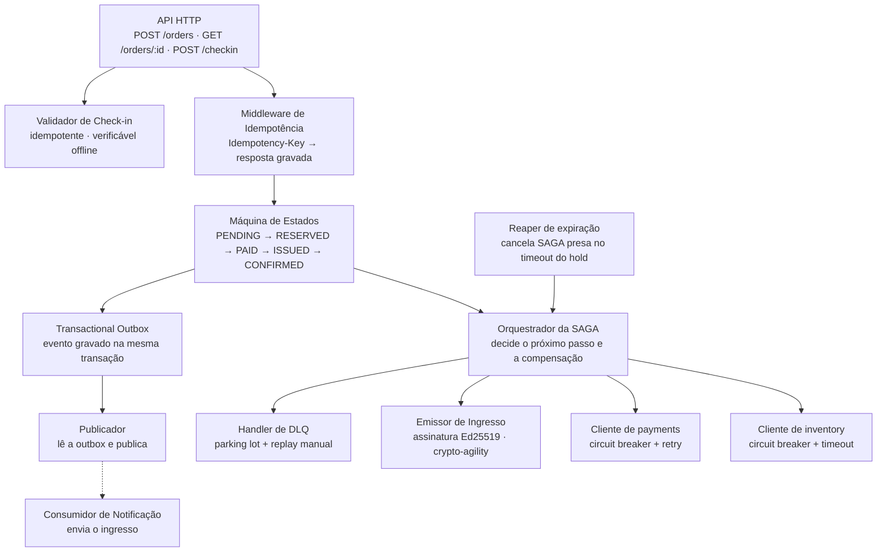
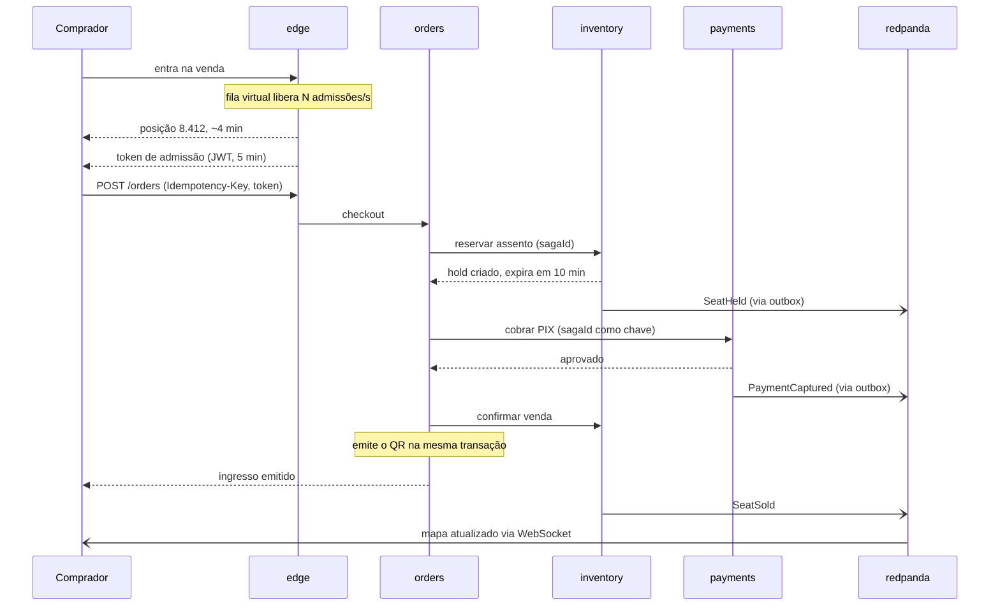

# Arquitetura

## Dois princípios organizadores

**Primeiro: consistência forte é cara, então ela é gasta apenas onde a violação é inaceitável.**

Há exatamente dois lugares onde uma inconsistência é intolerável: o assento (vender duas vezes é
fraude) e o dinheiro (cobrar duas vezes é fraude). Esses dois pontos são ACID, transacionais e
deliberadamente pequenos. Todo o resto — catálogo, mapa de assentos exibido na tela, contadores,
notificações — é eventualmente consistente e alimentado por eventos.

Como o núcleo ACID não escala horizontalmente na mesma proporção que o resto, ele é protegido por
**controle de admissão**: a fila virtual regula quantos usuários chegam ao núcleo por segundo,
transformando um pico impossível de absorver em uma vazão constante e dimensionável.

```
        pico irregular          vazão controlada        núcleo pequeno
     ~~~~~~~~~~~~~~~~~~~   →   ─────────────────   →   [ ACID ]
      100k req/s em rajada      2k req/s constante      assento + dinheiro
```

**Segundo: um serviço só existe se tiver uma fronteira de consistência própria ou um perfil de
escala próprio.** Todo o resto é módulo.

Essa regra cortou o desenho original de dez serviços para seis, sem perder um único padrão
arquitetural. O raciocínio completo, incluindo as extrações rejeitadas e o erro de modelagem que
o corte revelou, está no [ADR-0001](adr/0001-microsservicos.md).

---

## C4 Nível 1 — Contexto



**Fronteira do sistema.** O PSP é externo e falível por definição: pode responder com timeout para
uma cobrança que foi aprovada. Todo o desenho da SAGA e da idempotência existe por causa dessa
única propriedade.

---

## C4 Nível 2 — Containers



### Catálogo de containers

| Serviço | Responsabilidade | Estado | Consistência | O que justifica o processo próprio |
|---|---|---|---|---|
| `edge` | Ponto único de entrada. Valida JWT, aplica rate limit por identidade e IP, mantém a fila virtual, emite token de admissão e descarta carga de baixa prioridade sob sobrecarga | Estado em Redis | Forte no Redis | **Perfil de escala.** Absorve a enxurrada inteira; stateless, replicável e descartável |
| `catalog` | Serve eventos, sessões e mapa de assentos a partir de um read model desnormalizado | Read model | Eventual | **Perfil de escala.** Leitura é ordens de magnitude maior que a escrita e tolera defasagem |
| `inventory` | **Dono da verdade sobre o assento.** Cria reservas com expiração, confirma venda, libera na compensação | Postgres próprio | **Forte (ACID)** | **Fronteira de consistência.** Dono de uma invariante física: um assento, um dono |
| `orders` | Orquestrador da SAGA, máquina de estados do pedido, emissão do QR assinado, check-in na portaria e envio da confirmação | Postgres próprio | Forte local | **Fronteira de consistência.** Dono de um processo, não de um dado: garante que a SAGA chega a um estado terminal |
| `payments` | Cobrança no PSP falso atrás de um ACL e ledger de dupla entrada imutável | Postgres próprio | **Forte (ACID)** | **Fronteira de consistência.** Dono do dinheiro, com o requisito de auditoria mais forte do sistema |
| `realtime` | Fan-out por WebSocket do estado do mapa e da posição na fila | Conexões em memória | Eventual | **Perfil de escala.** Conexões longas, consumo de memória linear no número de espectadores |

### Módulos internos relevantes

Estes carregam padrões avaliados, mas não justificam processo próprio:

| Módulo | Onde vive | Por quê |
|---|---|---|
| Fila virtual | `edge` | Mesmo perfil de escala do gateway; separar acrescentaria um salto de rede no caminho mais quente |
| Emissão de JWT | `edge` | Substitui o provedor OIDC; cobre assinatura, expiração e claims |
| Emissão e validação de ingresso | `orders` | O ingresso é o resultado do pedido; mesmo ciclo de vida, mesma transação de confirmação |
| Notificação | `orders` | Consumidor idempotente; não demonstra padrão que outro consumidor já não demonstre |

### Catorze contêineres, e nada mais

| Contêiner | Papel |
|---|---|
| `edge`, `catalog`, `inventory`, `orders`, `payments`, `realtime` | Os seis serviços |
| `postgres` | Uma instância, três bancos lógicos isolados por credencial |
| `redis` | Cache do catálogo e estado da fila virtual |
| `redpanda` | Barramento de eventos |
| `traefik` | Balanceamento, canary e blue-green |
| `psp-sandbox` | PIX falso, com injeção de latência e erro sob demanda |
| `prometheus`, `grafana`, `jaeger` | Métricas e trace distribuído |

O plano anterior chegava a cerca de vinte contêineres. A demonstração ao vivo agora cabe com folga
na máquina de qualquer integrante — o que protege os 20% da nota que dependem dela funcionar.

### Uma nota sobre os bancos

Os três serviços transacionais têm bancos **logicamente** separados — schemas distintos, usuários
distintos, nenhuma query atravessando a fronteira — mas rodam em uma única instância PostgreSQL na
execução local. Isso economiza contêineres na demo sem afetar o padrão *Database per Service*, que
é sobre acoplamento por schema, não sobre contagem de processos. A separação é real onde importa:
credenciais distintas por serviço, e nenhuma query autorizada a cruzar a fronteira.

---

## C4 Nível 3 — Componentes do `orders`

É o serviço mais denso do sistema: conduz a SAGA, emite o ingresso e valida o check-in.



### A SAGA de compra

```
  passo                     sucesso                     compensação
  ─────────────────────────────────────────────────────────────────────────
  1. reservar assento    →  RESERVED (hold, TTL 10min)  →  liberar assento
  2. cobrar via PIX      →  PAID                        →  estornar
  3. emitir e confirmar  →  CONFIRMED (terminal)        →  invalidar e liberar
```

Com a emissão do ingresso dentro do `orders`, o passo 3 é **local e transacional**: emitir o QR e
confirmar a venda acontecem na mesma transação de banco. Isso elimina uma janela de inconsistência
que existia no desenho de dez serviços — o estado "pago, ingresso ainda não emitido" era visível
ao usuário e precisava de tratamento na interface. Agora ele não existe.

É um bom exemplo de por que menos serviços podem significar mais correção: cada fronteira de rede
a menos é uma janela de falha parcial a menos.

Cada passo é idempotente e carrega a `sagaId` como chave. Um passo que dá timeout **não** é
tratado como falha: o orquestrador consulta o estado real no serviço de destino antes de
compensar, porque um timeout do PSP não distingue "não cobrou" de "cobrou e a resposta se perdeu".
Essa consulta de reconciliação é o motivo pelo qual o `payments` precisa de idempotência de
leitura, não só de escrita.

O `reaper` de expiração impede o modo de falha mais perigoso do sistema: uma SAGA que morre entre
o passo 1 e o passo 2 deixaria o assento reservado para sempre. O hold tem TTL e o reaper varre
holds vencidos, liberando o assento e cancelando a SAGA.

---

## Fluxo de escrita: da fila ao ingresso



---

## Stack e justificativas

| Camada | Escolha | Por quê |
|---|---|---|
| Serviços | TypeScript + Fastify | Um único idioma em todos os serviços mantém cinco pessoas produtivas em paralelo; Fastify tem overhead baixo o suficiente para não distorcer a medição de latência |
| Banco transacional | PostgreSQL, um banco lógico por serviço | `SELECT ... FOR UPDATE` e constraints únicas resolvem o overselling de forma direta e auditável; isolamento por credencial evita acoplamento por schema |
| Cache e fila | Redis | Estruturas certas para o problema: `ZSET` para posição na fila, chaves com expiração para cache-aside |
| Barramento | Redpanda | Compatível com Kafka, binário único, sobe em Compose sem ZooKeeper; retenção e ordenação por partição são o que a outbox precisa |
| Borda | Traefik | Balanceamento e pesos de canary por configuração declarativa, sem escrever proxy à mão |
| Identidade | JWT assinado, emitido por um módulo do `edge` | Cobre assinatura, expiração e validação de claims sem o custo de configurar um provedor OIDC completo — decisão registrada em [`escopo.md`](escopo.md) |
| Observabilidade | OpenTelemetry → Prometheus, Grafana, Jaeger | Não é enfeite: a dimensão de Testes exige "métricas coletadas" e o videocast exige demonstração funcional. O trace é o instrumento que produz as duas evidências |
| Carga e falhas | k6 + o próprio PSP falso | k6 gera os percentis exigidos; o PSP é nosso e já expõe injeção de latência e erro, o que dispensa Toxiproxy |
| Execução | Docker Compose | É o que o checklist da Seção 7 pede: "Docker Compose ou equivalente para execução local". Canary e blue-green saem dos pesos do Traefik, dentro do próprio Compose |

### O que foi deliberadamente rejeitado

- **Reserva de assento em Redis** (rápido, mas a durabilidade é fraca demais para a invariante que
  mais importa). Redis entra como cache de leitura e estado de fila, nunca como fonte da verdade
  do assento.
- **Coreografia pura na compra.** Discutido em [`adr/0004`](adr/0004-saga-orquestrada.md): o fluxo
  de dinheiro precisa de um lugar único onde o estado do processo é legível.
- **Autoscaling como resposta ao pico.** Provisionar para 1000× por 90 segundos é caro e lento
  para reagir; controle de admissão resolve o mesmo problema com custo constante.
- **Quatro serviços a mais.** `waiting-room`, `ticketing`, `antifraud` e `notifier` existiam no
  desenho original e não sobreviveram à regra de extração do [ADR-0001](adr/0001-microsservicos.md).
- **Kubernetes, mTLS, OPA, Debezium, Keycloak, Unleash, Toxiproxy e a trilha de cripto
  pós-quântica.** Todos eram bônus da Seção 8 ou custavam mais do que entregavam. O corte, com o
  custo de cada item e o caminho de volta, está em [`escopo.md`](escopo.md).
