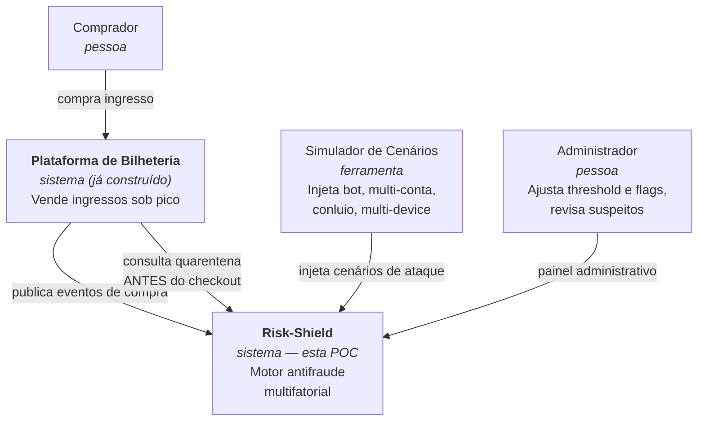
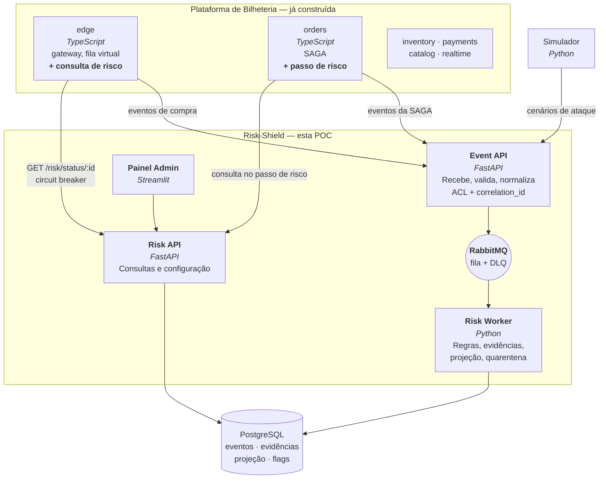

# Risk-Shield — Antifraude para Bilheteria

> **POC 2 — Antifraude Mínimo Viável**, no domínio de venda de ingressos.
> Replanejamento da [Documentação Inicial do Projeto 2](https://github.com/ArthurMT03/risk-shield),
> trocando a Plataforma de Jogos pela Plataforma de Bilheteria.

---

## 1. O que muda e o que não muda

A documentação inicial que vocês entregaram continua **inteira de pé**. Arquitetura,
stack, padrões, os dois ADRs e a divisão de responsabilidades permanecem exatamente
como estão. O que muda é o **domínio dos eventos** — e isso não altera nenhuma
decisão arquitetural, porque o motor antifraude nunca dependeu do domínio: ele
recebe eventos normalizados por uma camada de anticorrupção, que é justamente o
lugar onde a troca acontece.

| | Documentação inicial | Agora |
|---|---|---|
| Origem dos eventos | Plataforma de Jogos (fictícia) | **Plataforma de Bilheteria (real, já construída)** |
| Sujeito do risco | Jogador | Comprador |
| Ação sensível protegida | "ações sensíveis" (genérico) | **Checkout de ingresso** |
| Simulador de Cenários | Única fonte de eventos | Gerador dos **cenários de ataque**; o tráfego legítimo vem da plataforma real |
| Stack | Python 3.12, FastAPI, RabbitMQ, PostgreSQL, Streamlit | **Idêntica** |
| Padrões | EDA, CQRS, Event Sourcing, Feature Flag, ACL | **Idênticos**, mais Circuit Breaker e SAGA (ver §2) |
| ADR-001 e ADR-002 | RabbitMQ; scoring por regras | **Idênticos** |
| Divisão de responsabilidades | 4 integrantes | **Idêntica** |

O documento diz, na Seção 2:

> *"Na POC, a Plataforma de Jogos é representada como consumidora desse estado:
> espera-se que consulte a situação do jogador antes de permitir ações sensíveis."*

Essa expectativa deixa de ser uma expectativa. A Bilheteria **de fato** consulta o
estado de quarentena antes do checkout, e o efeito é visível na tela.

---

## 2. Os dois padrões que faltavam

A Seção 4.2 da especificação da disciplina recomenda seis padrões para a POC 2:

> *Circuit Breaker, CQRS, Event Sourcing, SAGA/Orchestration Pattern, Feature Flag,
> Anti-corruption Layer*

A documentação inicial cobre quatro. **Circuit Breaker e SAGA/Orchestration não
aparecem** — e não é descuido: eles simplesmente não têm onde existir num sistema
que só recebe eventos e grava scores. Não há chamada síncrona a proteger nem
processo distribuído a orquestrar.

O ponto de integração com a Bilheteria cria os dois, de forma natural e não
decorativa:

**Circuit Breaker.** O `edge` da Bilheteria consulta a Risk API antes de liberar o
checkout. Isso é uma chamada síncrona para um sistema externo no caminho mais
crítico que existe — e levanta uma pergunta de engenharia genuína:

> *Se o antifraude cair, a venda para?*

A resposta é uma decisão de produto, não de código, e por isso fica atrás de uma
feature flag: `risk_check_mode = fail_open | fail_closed`. Em `fail_open`, uma
indisponibilidade do antifraude deixa as vendas passarem — prefere-se perder
detecção a perder receita. Em `fail_closed`, o checkout é bloqueado. O circuit
breaker é o que impede que a decisão vire um travamento por timeout.

**SAGA/Orchestration.** A SAGA de compra já existe na Bilheteria e ganha um passo
de avaliação de risco. Um comprador que entra em quarentena **no meio da compra**
— entre a reserva do assento e a captura do pagamento — obriga à compensação:
libera o assento, estorna se já cobrou. É a mesma máquina de estados, com uma
transição a mais.

Resultado: **6 de 6 padrões recomendados**, sem inventar nada.

---

## 3. Mapeamento do domínio

O golpe muda de nome, não de forma. E o domínio de bilheteria é melhor para
demonstrar antifraude do que o de jogos, por um motivo simples: **cambismo é uma
fraude real, documentada e com incentivo econômico direto**. Um ingresso de show
esgotado vale várias vezes o preço de face na revenda. O adversário não é
hipotético.

| Documentação inicial | Bilheteria |
|---|---|
| Jogador | Comprador |
| Evento de ação do jogador | Evento de compra: entrada na fila, admissão, leitura do mapa, seleção de assento, checkout, pagamento, check-in |
| Bot | Bot de cambista comprando em velocidade sobre-humana |
| Múltiplas contas | Cambista operando N contas contra o mesmo evento |
| Conluio coordenado | Grupo comprando assentos adjacentes em bloco, de forma sincronizada, para revender o lote |
| Múltiplos dispositivos | Mesma conta com N fingerprints, ou N contas com o mesmo fingerprint |
| Quarentena do jogador | Quarentena do comprador: bloqueia novos checkouts e retém os ingressos já emitidos para revisão |

### Os quatro fatores, no domínio de ingresso

A especificação exige exatamente estes quatro. Cada um vira uma regra com peso e
evidência própria.

**F1 — Device fingerprint**
- O mesmo fingerprint aparece em N contas distintas dentro de uma janela → cambista
  com várias contas na mesma máquina.
- Uma conta apresenta N fingerprints distintos na mesma sessão → fazenda de
  celulares, ou fingerprint forjado a cada requisição.

**F2 — Velocidade de ação**
- Tempo entre a admissão na fila e o checkout **abaixo do humanamente possível**.
  Uma pessoa precisa olhar o mapa, escolher e clicar; 400 ms não dá.
- Intervalo entre compras consecutivas com **variância quase zero** — gente não tem
  cadência de metrônomo.
- Compras por minuto acima do teto plausível.

**F3 — Padrão de escolhas**
- Escolhe sempre o setor mais caro, sempre os melhores lugares disponíveis, nunca
  desiste, nunca troca de ideia.
- Faz checkout **sem ter lido o mapa antes** — não há evento de leitura precedendo a
  seleção. É o sinal mais limpo de automação: o bot já sabe o que quer.
- Compra sempre em blocos adjacentes.

**F4 — Correlação entre contas**
- Contas no mesmo IP ou na mesma sub-rede.
- Contas criadas dentro da mesma janela de tempo.
- Mesmo instrumento de pagamento (hash da chave PIX) em contas diferentes.
- **Compra coordenada:** N contas levando assentos adjacentes dentro de poucos
  segundos. Isoladamente cada compra é inocente; o padrão é que não é.

### Quarentena ≠ cancelamento

Uma diferença importante em relação ao domínio de jogos, e que vale ser dita na
apresentação: **falso positivo aqui tem custo real**. Cancelar o ingresso de uma
pessoa legítima é pior do que deixar um cambista passar.

Por isso a quarentena tem dois efeitos, e nenhum deles é destrutivo:

1. **Bloqueia novos checkouts** — o `edge` consulta antes e recusa.
2. **Retém os ingressos já emitidos** em `PENDING_REVIEW` — eles não são
   invalidados automaticamente. Ficam pendentes de decisão humana no Painel
   Administrativo, que pode liberar ou confirmar a fraude.

Nenhuma ação irreversível é tomada por um score.

---

## 4. Cenários do simulador

Seis cenários, validados a cada `make scenarios`. **Dois deles são compradores
legítimos que exibem sinais suspeitos de verdade, e a asserção é que NÃO sejam
bloqueados.** Um teste antifraude que só tem casos de fraude não mede precisão —
mede sensibilidade, e qualquer regra suficientemente paranoica passa.

| # | Cenário | Comportamento | Faixa esperada | Medido | Estado |
|---|---|---|---|---|---|
| C1 | **Comprador legítimo** | Entra na fila, lê o mapa 3×, espera, compra | 0 a 20 | **0,0** | livre |
| C2 | **Bot solitário** | 14 tentativas a cada 300 ms exatos, sem ler o mapa | 70 a 85 | **75,0** | quarentena |
| C3 | **Fazenda de contas** | 20 contas, 1 device, 1 IP, 3 cartões, disparando juntas | 90 a 100 | **100,0** | quarentena |
| C4 | **Conluio distribuído** | 12 contas, cada uma com device e IP próprios, mesmo setor em segundos | 80 a 100 | **91,9** | quarentena |
| C5 | **Rotação de fingerprint** | 1 conta em 15 devices, mas lendo o mapa e comprando em ritmo humano | 25 a 60 | **43,6** | **livre** |
| C6 | **Família** | 4 contas, mesmo notebook, mesmo Wi-Fi, mesmo cartão, 6 lugares | 5 a 50 | **22,5** | **livre** |

### Três correções em relação ao rascunho deste plano

O conjunto acima não é o que estava escrito aqui antes. Três cenários mudaram, e
os motivos valem mais do que a tabela.

**O "Bot" era esperado acima de 85, e fica em 75.** Um bot solitário — uma conta,
um dispositivo, um IP — é *estruturalmente incapaz* de disparar os dois fatores
contextuais: não há com quem correlacionar. O máximo que ele alcança são os dois
fatores comportamentais. Isso obrigou a reescrever os pesos para que dois fatores
bastassem (ADR-0013); com os pesos originais, somando 100, o bot solitário
chegava a 50 e passava sempre. A correção não foi afrouxar o limiar — foi
descobrir que o modelo era cego a ele por construção.

**O "Conluio" ganhou automação.** Doze contas com identidades genuinamente
distintas, comprando assentos vizinhos em ritmo humano, valem 24,5 pontos e
passam — e está certo que passem: é indistinguível de um grupo de amigos
combinando pelo WhatsApp, ou de um setor popular abrindo numa venda relâmpago.
O que torna o cenário detectável é a quadrilha comprar **sem ler o mapa e em
milissegundos**. O cenário C4 é, portanto, uma frota distribuída que evadiu
dispositivo e IP mas não conseguiu evadir o comportamento — que é a lição mais
interessante do conjunto.

**O "Multi-dispositivo" virou falso positivo.** Uma conta em 15 *fingerprints*
com navegação humana era esperada em quarentena; ela fica em 43,6 e passa. O fator
de dispositivo satura em severidade 1, mas um fator sozinho vale 35 pontos — metade
do limiar. É de propósito: navegadores com proteção contra rastreamento randomizam
*fingerprint* a cada aba, e uma rede corporativa produz o mesmo efeito. Acusar por
associação sozinha é como o antifraude vira gerador de prejuízo. O cenário mudou de
lado, e o sistema fica melhor por isso.

O limiar de 70 cai entre 43,6 e 75,0. A folga é de mais de 30 pontos para os dois
lados, e o caso mais apertado — o bot solitário, a 5 pontos — é justamente o que
deve ser apertado.

### O que o próprio teste de fumaça revelou

Ao ligar a integração, a bateria de fumaça da Bilheteria foi **bloqueada pelo
antifraude**: `53 tentativas de compra nos ultimos 10 minutos`. O detector estava
certo. O gerador de carga é que não é um cliente — a verificação de contenção
precisa de 40 contas disputando o mesmo assento e a de idempotência dispara 50
requisições idênticas em paralelo, tudo do mesmo endereço.

A conclusão é operacional e vale registrar: geradores de carga e sondas sintéticas
precisam de um caminho declarado que não passe pelo antifraude, senão a própria
monitoração acorda o plantão. Aqui isso é a *flag* `risk_check_mode=disabled`, que
a bateria de fumaça liga no início e devolve ao padrão no fim — e o portão tem
teste próprio, `make risk-gate`, mais forte do que uma asserção incidental.

---

## 5. Arquitetura

### C4 Nível 1 — Contexto

A diferença para o diagrama original: a Plataforma deixa de ser uma caixa
hipotética e passa a ser um sistema real, que **produz** eventos e **consome** o
estado de quarentena. As duas setas entre Bilheteria e Risk-Shield são o coração
da POC.

### C4 Nível 2 — Containers

**Fronteira entre os dois sistemas.** Eles não compartilham banco. A Bilheteria fala
com o Risk-Shield por dois canais explícitos: eventos assíncronos (produção) e uma
consulta HTTP síncrona (leitura de quarentena). Nada mais. É a fronteira que
permite dizer, com honestidade, que são dois sistemas distribuídos conversando — e
não um monolito com duas pastas.

---

## 6. Modelo de dados

Direto do que a documentação inicial já definiu, com nomes do domínio de ingresso.

**Lado de comando** (escrita, normalizado):

| Tabela | Conteúdo |
|---|---|
| `processed_events` | `event_id` UUID como chave primária. É o que garante o *effectively-once* do ADR-001 |
| `purchase_events` | Evento normalizado: tipo, `buyer_id`, `event_id` do show, assento, fingerprint, IP, timestamp UTC, `correlation_id`, `schema_version` |
| `risk_evidence` | **Append-only.** Uma linha por regra que pontuou: fator, peso, valor observado, explicação em texto |
| `quarantine_history` | Entradas e saídas de quarentena, com motivo e autor (automático ou administrador) |
| `rule_flags` | Feature flags e pesos, lidos a cada mensagem |

**Lado de consulta** (projeção desnormalizada):

| Tabela | Conteúdo |
|---|---|
| `buyer_risk_summary` | `buyer_id`, score atual, principais fatores, estado de quarentena, atualizada na **mesma transação** da evidência |

O score **não é uma coluna que se soma**. É derivado da sequência de evidências — é
isso que permite recalcular tudo quando os pesos mudam, e explicar *por quê* um
comprador foi marcado. A projeção é cache, não fonte da verdade.

---

## 7. Decisões preservadas da documentação inicial

Nada disto muda; está listado para não se perder na tradução de domínio.

- **`correlation_id`** gerado na Event API, propagado no header do RabbitMQ, nos logs
  do worker e nas linhas do PostgreSQL. Rastreia um evento de ponta a ponta.
- **Idempotência do consumidor:** `event_id` UUID + `INSERT ... ON CONFLICT DO
  NOTHING`. Entrega *at-least-once* + consumidor idempotente = *effectively-once*.
- **Transação única:** registro do evento, gravação das evidências e atualização da
  projeção num só commit. O *ack* só depois.
- **DLQ após 3 tentativas**, com o conteúdo exposto no Painel Administrativo.
- **Score de 0 a 100, threshold inicial 70**, ajustável pelo administrador.
- **Flags lidas a cada mensagem**, para efeito imediato sem reiniciar nada.
- **ACL com `schema_version`**, normalizando timestamps para UTC.

Uma adição pequena e necessária: a Event API passa a aceitar **dois formatos**
externos — o da Bilheteria e o do Simulador — normalizando ambos para o mesmo
modelo interno. Isso não enfraquece o Anti-Corruption Layer; é exatamente o caso
de uso que justifica ele existir.

---

## 8. Integração com a Bilheteria

Três pontos de contato, e mais nada.

**1. Produção de eventos.** O `edge` e o `orders` publicam para a Event API o que já
acontece hoje: admissão na fila, leitura do mapa, seleção de assento, checkout,
pagamento, check-in. O `fingerprint` e o IP já chegam ao `edge`; o resto é
reaproveitar o que existe.

**2. Consulta antes do checkout.** O `edge` chama `GET /risk/status/{buyer_id}` antes
de liberar a compra:

| Estado | Efeito |
|---|---|
| `CLEAR` | Segue normalmente |
| `QUARANTINED` | HTTP 403, com motivo legível ao comprador |
| Risk API indisponível | Decidido pela flag `risk_check_mode` |

**3. Passo de risco na SAGA.** Quando a quarentena chega no meio de uma compra já
iniciada, a SAGA compensa: libera o assento, estorna se já houve cobrança. É o
caminho que a Bilheteria já sabe executar.

---

## 9. Stack

A da Bilheteria, e não a da documentação inicial. É a mudança mais importante
deste plano em relação ao rascunho, e a razão vale mais do que a escolha.

| Componente | Rascunho | Construído |
|---|---|---|
| Event API, Risk API, Risk Worker, Simulador | Python 3.12 + FastAPI + Pydantic | **TypeScript + Fastify** |
| Broker | RabbitMQ, com DLQ | **Redpanda (Kafka), com DLQ** |
| Persistência | PostgreSQL, com JSONB | PostgreSQL, com JSONB |
| Painel Administrativo | Streamlit | **HTML servido pelo `risk-api`** |
| Execução | Docker Compose | Docker Compose |
| CI | GitHub Actions com Ruff e Pytest | **GitHub Actions: tipos, unitários e a bateria inteira contra o sistema no ar** |

O argumento a favor de Python era bom e foi descartado por um argumento melhor.
Ele dizia: dois sistemas em linguagens diferentes provam que o Anti-Corruption
Layer faz trabalho de verdade. Mas a heterogeneidade de linguagem não é o que
prova isso — **é a heterogeneidade de contrato.** E ela existe do mesmo jeito:
a Bilheteria escreve `camelCase` sem timestamp, o Simulador escreve `snake_case`
com timestamp sem fuso, e o motor não conhece nenhum dos dois formatos. O teste
`risk-acl.test.ts` verifica que as duas origens produzem o mesmo evento interno.

O que Python custaria, em compensação, é concreto: um segundo `Dockerfile`, um
segundo gerenciador de dependências, um segundo conjunto de ferramentas de teste,
e — o mais caro — **reescrever em Python** o tracer OTLP, o cliente HTTP com
circuit breaker, o consumidor com DLQ e o emissor de métricas que já existem e já
foram testados. Seriam duas implementações dos mesmos padrões, com o dobro da
superfície de bug e nenhum ganho arquitetural.

Redpanda no lugar de RabbitMQ pelo mesmo raciocínio: o barramento já está de pé,
e a garantia que o motor precisa — **ordem por comprador** — é particionamento por
chave, que é exatamente o que um log particionado oferece e uma fila AMQP não.

### Custo de recursos

A Bilheteria são 15 contêineres; o Risk-Shield acrescenta **3**, e não 5: não há
broker novo (o Redpanda é reaproveitado, com **tópico próprio**) nem contêiner de
painel (o `risk-api` o serve). O PostgreSQL também é reaproveitado, com banco
lógico e credenciais próprias — a fronteira entre os sistemas continua real.

Total: **18 contêineres**, medidos.

---

## 10. Divisão de responsabilidades

A mesma da documentação inicial, com o acréscimo da integração distribuído entre
quem já é dono de cada lado.

| Integrante | Responsabilidade |
|---|---|
| **Arthur Miranda** | Documentação, diagramas C4, ADRs, organização do repositório |
| **Tiago Trindade** | Event API, validação e normalização (ACL), integração com RabbitMQ, Simulador de Cenários |
| **Pedro Henrique** | Motor de scoring, Risk Worker, persistência, quarentena automática |
| **Nicholas Rodrigues** | Risk API, feature flags, Painel Administrativo, Docker Compose, CI **e o ponto de integração com a Bilheteria** |

---

## 11. Roadmap

Fases com dependência explícita. A regra que destrava o trabalho em paralelo:
**contratos primeiro** — o schema do evento normalizado e o contrato da Risk API
entram na Fase 0, antes de qualquer lógica.

| Fase | Conteúdo | Marco |
|---|---|---|
| **0 · Fundação** | Compose com PostgreSQL e RabbitMQ, esqueleto dos três serviços, schema do evento, migrações, CI | `docker compose up` verde |
| **1 · Caminho do evento** | Event API recebendo e normalizando, publicando; Risk Worker consumindo com idempotência e gravando | Um evento atravessa o sistema e aparece no banco com `correlation_id` |
| **2 · Motor de risco** | Os quatro fatores, evidências, projeção, quarentena por threshold | Cenário de bot ultrapassa 85 e entra em quarentena |
| **3 · Painel e flags** | Streamlit, ajuste de threshold, ativar/desativar regras, inspeção da DLQ, revisão de suspeitos | Desligar uma regra muda o score na hora |
| **4 · Simulador** | Os seis cenários, com faixas esperadas | `make scenarios` valida todos |
| **5 · Integração** | Bilheteria produzindo eventos, consulta antes do checkout, circuit breaker, passo de risco na SAGA | Bot é barrado **na tela**, com o motivo |
| **6 · Evidência** | Testes, CI validando os cenários, resultados medidos, documentação final | Bateria completa verde |

A Fase 5 é a que fecha os dois padrões faltantes e é a que rende no videocast: dá
para mostrar um bot comprando, o score subindo ao vivo no painel, a quarentena
sendo aplicada e o checkout seguinte sendo recusado.

---

## 12. O que precisa ser corrigido na documentação inicial

Para a entrega final ficar coerente com o que foi escrito:

1. **Trocar "Plataforma de Jogos" por "Plataforma de Bilheteria"** e "jogador" por
   "comprador" ao longo do texto e nos diagramas C4.
2. **Acrescentar Circuit Breaker e SAGA/Orchestration** à Seção 6, com o ponto de
   integração como justificativa — hoje faltam dois dos seis padrões recomendados.
3. **Atualizar o link do repositório** se o trabalho não for para `ArthurMT03/risk-shield`.
4. **Acrescentar o cenário de falso positivo** à Seção 10, junto dos outros cinco.
5. **Registrar a seção obrigatória de uso de IA** — a Seção 5 da especificação diz
   que a omissão desclassifica a entrega.

Vale também conferir com o professor: a especificação fala em **equipes de 5
integrantes** e a documentação inicial lista **4**.
